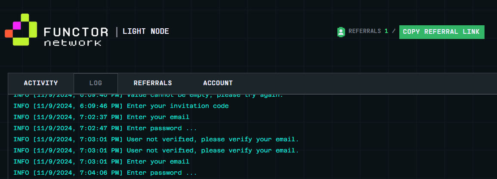

## Security Labs Automation Bot



An automation bot for Functor Network daily check-ins and managing multiple accounts.

## Features

- Multi-account support
- Automatic daily check-ins
- Token expiration tracking
- Balance monitoring
- Colored console output
- Visual countdown timer

## Prerequisite

- Node.js 18.x or higher
- Chrome browser
- Functor Network extension installed

## Installation

1. Install the [Functor Network](https://chromewebstore.google.com/detail/functor-node/gahmmgacnfeohncipkjfjfbdlpbfkfhi) from Chrome Web Store.

2. Register on [Functor Network](https://node.securitylabs.xyz/?from=extension&type=signin).

3. Clone this repository:

```bash
git clone https://github.com/Rambeboy/functor-network-bot.git && cd functor-network-bot
```

4. Install dependencies:

```bash
npm install
```

5. Configure your accounts:
```bash
cp config/config_tmp.js config.js
```

## Configuration

1. Edit `config.js` file in the root directory
2. Add your account tokens, one account per line:

```
eyj
eyj
```

## Usage

Start the bot:

```bash
npm run start
```

The bot will:

- Load accounts from data.txt
- Process each account and its tokens
- Perform daily check-ins
- Show token expiration dates
- Display current and updated balances
- Wait 24 hours before the next cycle

## Features Details

### Multi-Account Support

- Process multiple accounts independently
- Handle multiple tokens per account
- Configurable delays between accounts and tokens

### Automatic Check-ins

- Daily automated check-ins
- Cooldown monitoring
- Balance tracking before and after check-in

### Token Management

- Token expiration tracking
- Automatic token validation
- Clear expiration date display

## Error Handling

The bot includes:

- Graceful shutdown handling
- Token validation
- Connection error handling
- Clear error reporting

## License

This project is licensed under the MIT License - see the [LICENSE](LICENSE) file for details.

## Disclaimer

This bot is for educational purposes only. Use at your own risk and ensure you comply with Security Labs' terms of service.

## Acknowledgments

- Thanks to Security Labs for providing the platform
- Built with Node.js and various open-source libraries

